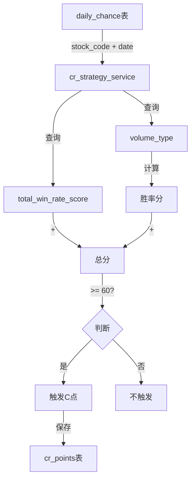

# CR点策略一实现总结

## 实现时间
2025-11-13

## 需求概述
重新实现CR点的逻辑，采用新的"策略一"：
- **公式**: 总分 = 赔率分（total_win_rate_score）+ 胜率分
- **触发条件**: 总分 >= 60分，则发C点
- **胜率分计算规则**（只看日线的volume_type）：
  * 温和放量（ABCD）任意一种，权重100%，得40分
  * 其他特殊型（H），权重70%，得28分
  * 异常量（EF）任意一种均不得分，权重0%，得0分

## 实现内容

### 1. 后端修改

#### 1.1 `backend/domain/services/cr_strategy_service.py`
**主要改动**：
- 将 `CRStrategyService` 从静态类改为实例类，添加 `__init__` 方法
- 注入 `DailyChanceRepositoryImpl` 依赖
- **重写 `check_c_point_strategy_1` 方法**：
  - 新增参数：`stock_code`、`date`、`volume_type`（可选）、`total_win_rate_score`（可选）
  - 从 `daily_chance` 表查询数据（如果没有传入参数）
  - 根据 `volume_type` 计算胜率分
  - 计算总分并判断是否触发C点（总分 >= 60）
  - 详细的日志记录
- **新增 `_calculate_win_rate_score` 静态方法**：
  - 根据 volume_type 计算胜率分
  - 异常量（E/F）优先级最高，返回0分
  - 温和放量（ABCD）返回40分
  - 其他特殊型（H）返回28分
  - 其他类型（X/Y/Z/G等）返回0分

**代码示例**：
```python
def check_c_point_strategy_1(self, stock_code: str, date: datetime, volume_type: Optional[str] = None, 
                              total_win_rate_score: Optional[float] = None) -> Tuple[bool, float, str]:
    """
    检查是否满足C点策略1（新逻辑）
    
    策略一：
    - 总分 = 赔率分（total_win_rate_score）+ 胜率分
    - 胜率分根据volume_type计算：
      * 温和放量（ABCD）任意一种：40分
      * 其他特殊型（H）：28分
      * 异常量（EF）任意一种：0分
    - 如果总分 >= 60，则触发C点
    """
    # ... 实现逻辑 ...
```

#### 1.2 `backend/application/services/cr_point_service.py`
**主要改动**：
- 修改 `analyze_and_save_cr_points` 方法中的C点检查逻辑
- 调用新的 `check_c_point_strategy_1` 接口，传入 `stock_code` 和 `kline.time`
- 仅在触发C点时计算ABC（用于记录）
- R点逻辑暂时保留原有实现（等待后续需求）

**代码示例**：
```python
# 检查C点策略1（新逻辑：基于赔率分+胜率分）
is_c_point, c_score, c_strategy = self.strategy_service.check_c_point_strategy_1(
    stock_code, 
    kline.time
)

if is_c_point:
    # 计算ABC（用于记录）
    abc = self.strategy_service.calculate_abc(
        kline.open,
        kline.high,
        kline.low,
        kline.close
    )
    # ... 保存C点 ...
```

#### 1.3 `backend/scripts/calculate_c_points.py`（新建）
**功能**：
- 批量计算所有股票的C点
- 从 `daily_chance` 表获取股票列表
- 获取每只股票最近450个交易日的日线数据
- 调用 `CRPointService` 分析并保存C点
- 输出详细的统计信息

**使用方法**：
```bash
cd backend
python scripts/calculate_c_points.py
```

### 2. 前端显示

#### 2.1 已有功能（无需修改）
前端已经实现了完整的CR点显示功能：
- **`loadCRPoints()`**: 自动加载CR点数据
- **`updateChartWithCRPoints()`**: 在K线图上显示C点和R点标记
  * C点：红色圆圈，显示在K线下方
  * R点：绿色圆圈，显示在K线上方
- **`updateCRPointsStats()`**: 更新统计信息显示（C点数量/R点数量）
- **`analyzeCRPoints()`**: 手动触发CR点分析
- **`toggleCRPoints()`**: 切换CR点显示/隐藏

#### 2.2 显示位置
- K线图上方的信息栏会显示："CR点: C点: X | R点: Y"
- K线图中会用标记点显示C点和R点的位置

### 3. 胜率分计算逻辑详解

#### 3.1 优先级
```
异常量（E/F）> 温和放量（ABCD）> 其他特殊型（H）> 其他类型
```

#### 3.2 计算规则
| 成交量类型 | 描述 | 权重 | 得分 | 优先级 |
|-----------|------|------|------|--------|
| E 或 F | 异常量 | 0% | 0分 | 最高 |
| A/B/C/D | 温和放量（任意一种） | 100% | 40分 | 高 |
| H | 其他特殊型 | 70% | 28分 | 中 |
| X/Y/Z/G等 | 其他类型 | 0% | 0分 | 低 |

#### 3.3 示例

**示例1**: 
- volume_type = "A,B"
- 包含温和放量A和B
- 胜率分 = 40分

**示例2**:
- volume_type = "H"
- 只有其他特殊型H
- 胜率分 = 28分

**示例3**:
- volume_type = "E,A"
- 包含异常量E（优先级最高）
- 胜率分 = 0分

**示例4**:
- volume_type = "X,Y"
- 只有X和Y类型
- 胜率分 = 0分

## C点触发条件总结

**公式**：
```
总分 = total_win_rate_score（赔率分）+ 胜率分
```

**触发条件**：
```
总分 >= 60
```

**示例**：
- 赔率分 = 25分，胜率分 = 40分（温和放量ABCD）
- 总分 = 25 + 40 = 65分 >= 60分
- ✅ 触发C点

- 赔率分 = 20分，胜率分 = 28分（其他特殊型H）
- 总分 = 20 + 28 = 48分 < 60分
- ❌ 不触发C点

- 赔率分 = 35分，胜率分 = 28分（其他特殊型H）
- 总分 = 35 + 28 = 63分 >= 60分
- ✅ 触发C点

## 数据流程



## R点逻辑

**状态**: 暂时保留原有逻辑
**说明**: 用户表示R点的逻辑稍后给出，当前仍使用原有的"上下影线均衡小实体"策略

## 测试建议

1. **单股票测试**:
   - 选择一只有 volume_type 和 total_win_rate_score 的股票
   - 运行脚本查看是否正确识别C点

2. **批量测试**:
   - 运行 `calculate_c_points.py` 批量计算
   - 检查日志输出，确认计算逻辑正确

3. **前端验证**:
   - 打开前端页面
   - 选择股票，查看K线图上的C点标记
   - 验证统计信息是否正确显示

## 注意事项

1. **数据依赖**: C点计算依赖于 `daily_chance` 表中的 `volume_type` 和 `total_win_rate_score` 字段，请确保这些数据已经计算并填充
2. **日期匹配**: 确保 `daily_data` 表和 `daily_chance` 表的日期格式一致
3. **异常处理**: 脚本已添加详细的异常处理和日志记录，便于排查问题
4. **性能考虑**: 批量计算所有股票可能需要较长时间，建议在非交易时间段运行

## 文件清单

### 修改的文件
1. `backend/domain/services/cr_strategy_service.py` - CR策略服务（重写C点逻辑）
2. `backend/application/services/cr_point_service.py` - CR点应用服务（调用新接口）

### 新建的文件
1. `backend/scripts/calculate_c_points.py` - 批量计算C点脚本

### 未修改的文件（前端已有完整功能）
1. `frontend/js/app.js` - 前端CR点显示逻辑
2. `frontend/index.html` - 前端HTML
3. `backend/domain/models/cr_point.py` - CR点模型
4. `backend/infrastructure/persistence/cr_point_repository_impl.py` - CR点仓储实现

## 完成状态

✅ 所有任务已完成：
1. ✅ 修改cr_strategy_service.py实现新的C点策略一计算逻辑
2. ✅ 修改cr_point_service.py调用新的策略接口
3. ✅ 前端显示C点标记（已有功能，无需修改）
4. ✅ 创建脚本批量计算所有股票的C点

